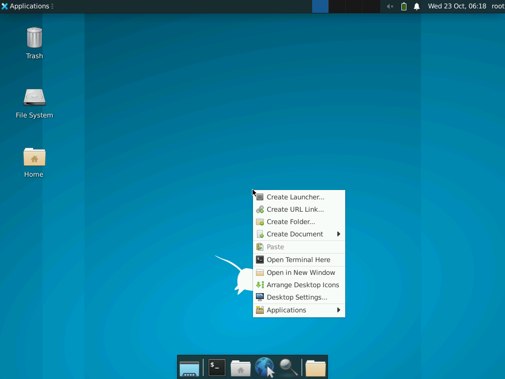

# E2B Desktop Sandbox

E2B Desktop Sandbox is an isolated cloud environment with a desktop-like interface powered by [E2B](https://e2b.dev).

Launching E2B Sandbox takes about 300-500ms. You can customize the desktop environment and preinstall any dependencies you want using our [custom sandbox templates](https://e2b.dev/docs/sandbox-template).



**Work in progress**
This repository is a work in progress. We welcome feedback and contributions. Here's the list of features we're working on:
- [ ] JavaScript SDK
- [ ] Streaming live desktop
- [ ] Tests
- [ ] Docstrings

## Getting started
The E2B Desktop Sandbox

### 1. Get E2B API key
Sign up at [E2B](https://e2b.dev) and get your API key.
Set environment variable `E2B_API_KEY` with your API key.

### 2. Create Desktop Sandbox
```python
from e2b_desktop import Sandbox

desktop = Sandbox()
```

### 3. Mouse control
```python
from e2b_desktop import Sandbox
desktop = Sandbox()

desktop.double_click()
desktop.left_click()
desktop.right_click()
desktop.middle_click()
desktop.scroll(10) # Scroll by the amount. Positive for up, negative for down.
desktop.mouse_move(100, 200) # Move to x, y coordinates
```

### 4. Locate on screen
```python
from e2b_desktop import Sandbox
desktop = Sandbox()

x, y = desktop.locate_on_screen("some text on screen")
```

### 4. Keyboard control
```python
from e2b_desktop import Sandbox
desktop = Sandbox()


desktop.write("Hello, world!") # Write text at the current cursor position
desktop.hotkey("ctrl", "c") # Press ctrl+c
```

### 5. Screenshot
```python
from e2b_desktop import Sandbox
desktop = Sandbox()

desktop.screenshot("screenshot.png")
```

### 4. Open application
```python
from e2b_desktop import Sandbox
desktop = Sandbox()

```

### 6. Run any bash commands
```python
from e2b_desktop import Sandbox
desktop = Sandbox()

```

### 7. Run PyAutoGUI commands
```python
from e2b_desktop import Sandbox
desktop = Sandbox()

```

### 8. Customization
```python
from e2b_desktop import Sandbox
desktop = Sandbox()

```


## Under the hood
You can use [PyAutoGUI](https://pyautogui.readthedocs.io/en/latest/) to control the whole environment programmatically.

The desktop-like environment is based on Linux and [Xfce](https://www.xfce.org/) at the moment. We chose Xfce because it's a fast and lightweight environment that's also popular and actively supported. However, this Sandbox template is fully customizable and you can create your own desktop environment.
Check out the code [here](./template/)