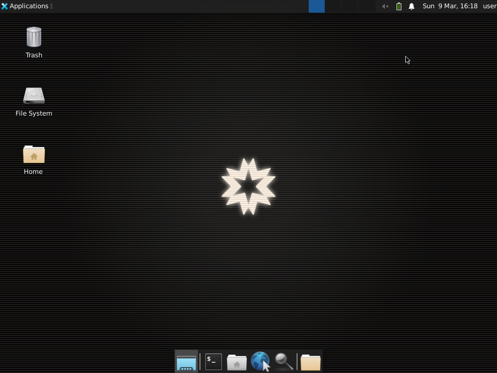
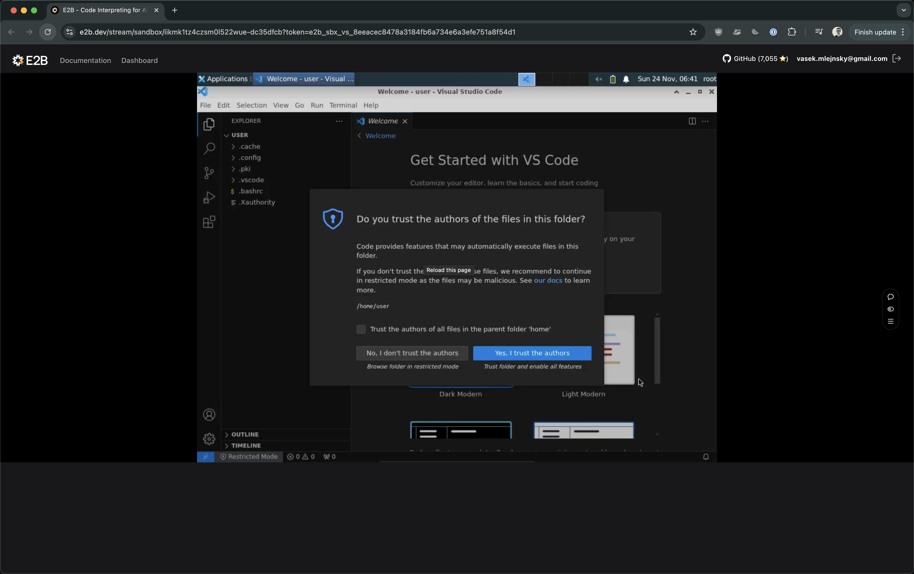

# E2B Desktop Sandbox - Virtual Computer for Computer Use

E2B Desktop Sandbox is a secure virtual desktop ready for Computer Use. Powered by [E2B](https://e2b.dev).

Each sandbox is isolated from the others and can be customized with any dependencies you want.



### Example app using Computer Use with Anthropic's Claude
Check out the [example open-source app](https://github.com/e2b-dev/secure-computer-use) in a separate repository.


## 🚀 Getting started
The E2B Desktop Sandbox is built on top of [E2B Sandbox](https://e2b.dev/docs).

### 1. Get E2B API key
Sign up at [E2B](https://e2b.dev) and get your API key.
Set environment variable `E2B_API_KEY` with your API key.

### 2. Install SDK
**Python**
```bash
pip install e2b-desktop
```

**JavaScript**
```bash
npm install @e2b/desktop
```

### 3. Create Desktop Sandbox
**Python**
```python
from e2b_desktop import Sandbox

desktop = Sandbox()
```

**JavaScript**
```javascript
import { Sandbox } from '@e2b/desktop'

const desktop = await Sandbox.create()
```

## Stream virtual desktop screen
You can enable streaming the desktop screen by passing `videoStream: true` to the `Sandbox.create` function in JavaScript and `video_stream=True` to the `Sandbox` constructor in Python.

Then call `getVideoStreamUrl` in JS and `get_video_stream_url` method in Python to get the stream URL that will look like this: `https://e2b.dev/stream/sandbox/<sandbox-id>?token=<secret-token>` and open it in your browser.

You'll need to wait a couple of seconds for the stream to buffer the first frames.

**Python**
```python
from e2b_desktop import Sandbox

desktop = Sandbox(video_stream=True)
stream_url = desktop.get_video_stream_url()
print(stream_url)
# Open stream_url in your browser
# You'll need to wait a couple of seconds for the stream to buffer the first frames
```

**JavaScript**
```javascript
import { Sandbox } from '@e2b/desktop'

const desktop = await Sandbox.create({ videoStream: true, onVideoStreamStart: (streamUrl) => {
  console.log(streamUrl)
}})
// Open streamUrl in your browser
// You'll need to wait a couple of seconds for the stream to buffer the first frames
```



## Features

### Mouse control

**Python**
```python
from e2b_desktop import Sandbox
desktop = Sandbox()

desktop.double_click()
desktop.left_click()
desktop.right_click()
desktop.middle_click()
desktop.scroll(10) # Scroll by the amount. Positive for up, negative for down.
desktop.mouse_move(100, 200) # Move to x, y coordinates
```

**JavaScript**
```javascript
import { Sandbox } from '@e2b/desktop'

const desktop = await Sandbox.create()

await desktop.doubleClick()
await desktop.leftClick()
await desktop.rightClick()
await desktop.middleClick()
await desktop.scroll(10) // Scroll by the amount. Positive for up, negative for down.
await desktop.moveMouse(100, 200) // Move to x, y coordinates
```

### Keyboard control

**Python**
```python
from e2b_desktop import Sandbox
desktop = Sandbox()

desktop.write("Hello, world!") # Write text at the current cursor position
desktop.hotkey("ctrl", "c") # Press ctrl+c
```

### Screenshot
```python
from e2b_desktop import Sandbox
desktop = Sandbox()

# Take a screenshot and save it as "screenshot.png" locally
image = desktop.take_screenshot()
# Save the image to a file
with open("screenshot.png", "wb") as f:
    f.write(image)
```

**JavaScript**
```javascript
import { Sandbox } from '@e2b/desktop'

const desktop = await Sandbox.create()
const image = await desktop.takeScreenshot()
// Save the image to a file
fs.writeFileSync("screenshot.png", image)
```

### Open file

**Python**
```python
from e2b_desktop import Sandbox
desktop = Sandbox()

# Open file with default application
desktop.files.write("/home/user/index.js", "console.log('hello')") # First create the file
desktop.open("/home/user/index.js") # Then open it
```

**JavaScript**
```javascript
import { Sandbox } from '@e2b/desktop'

const desktop = await Sandbox.create()

// Open file with default application
await desktop.files.write("/home/user/index.js", "console.log('hello')") // First create the file
await desktop.open("/home/user/index.js") // Then open it
```

### Run any bash commands
**Python**
```python
from e2b_desktop import Sandbox
desktop = Sandbox()

# Run any bash command
out = desktop.commands.run("ls -la /home/user")
print(out)
```

**JavaScript**
```javascript
import { Sandbox } from '@e2b/desktop'

const desktop = await Sandbox.create()

// Run any bash command
const out = await desktop.commands.run("ls -la /home/user")
console.log(out)
```

### Run PyAutoGUI commands
**Python**
```python
from e2b_desktop import Sandbox
desktop = Sandbox()

# Run any PyAutoGUI command
desktop.pyautogui("pyautogui.click()")
```

**JavaScript**
```javascript
import { Sandbox } from '@e2b/desktop'

const desktop = await Sandbox.create()

// Run any PyAutoGUI command
await desktop.runPyautoguiCode("pyautogui.click()")
```

<!-- ### Customization
```python
from e2b_desktop import Sandbox
desktop = Sandbox()
``` -->

## Under the hood
You can use [PyAutoGUI](https://pyautogui.readthedocs.io/en/latest/) to control the whole environment programmatically.

The desktop-like environment is based on Linux and [Xfce](https://www.xfce.org/) at the moment. We chose Xfce because it's a fast and lightweight environment that's also popular and actively supported. However, this Sandbox template is fully customizable and you can create your own desktop environment.
Check out the sandbox template's code [here](./template/).

